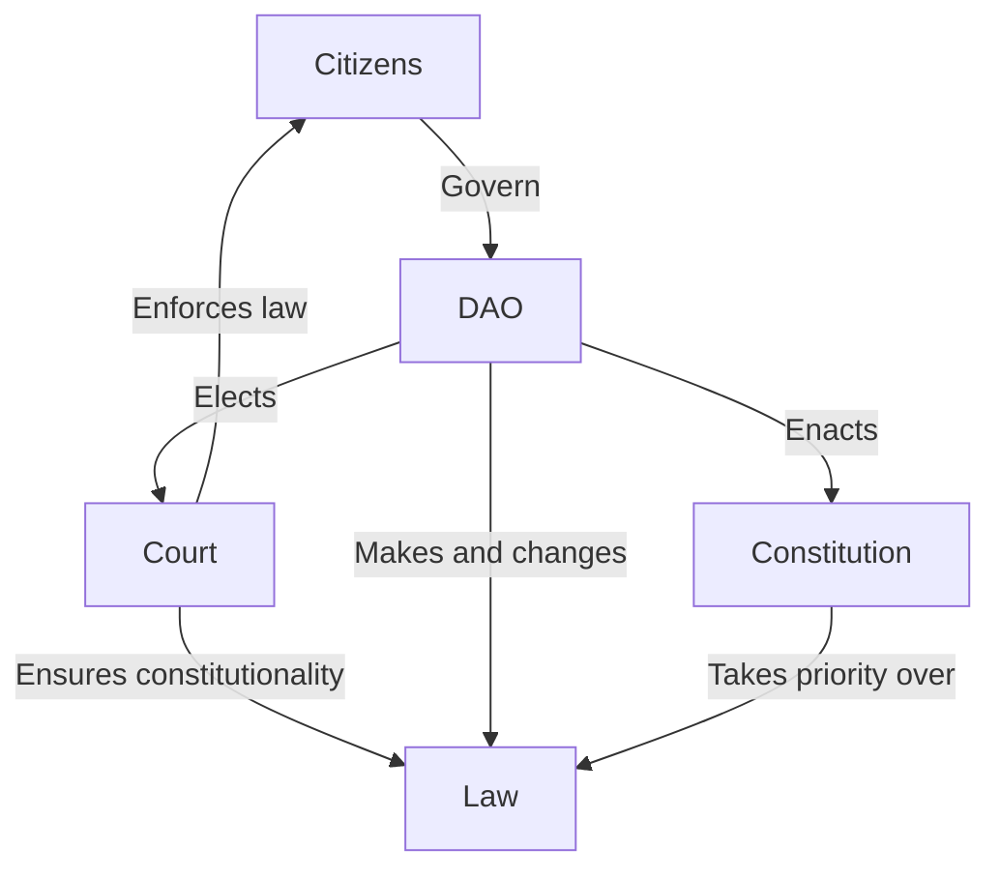
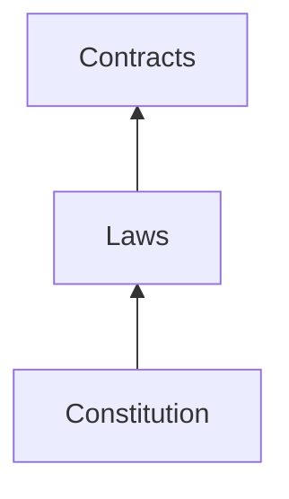
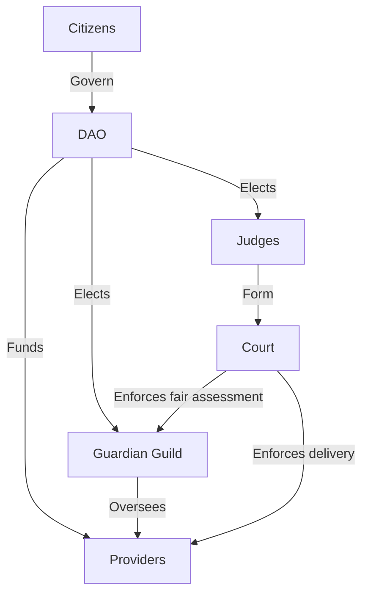
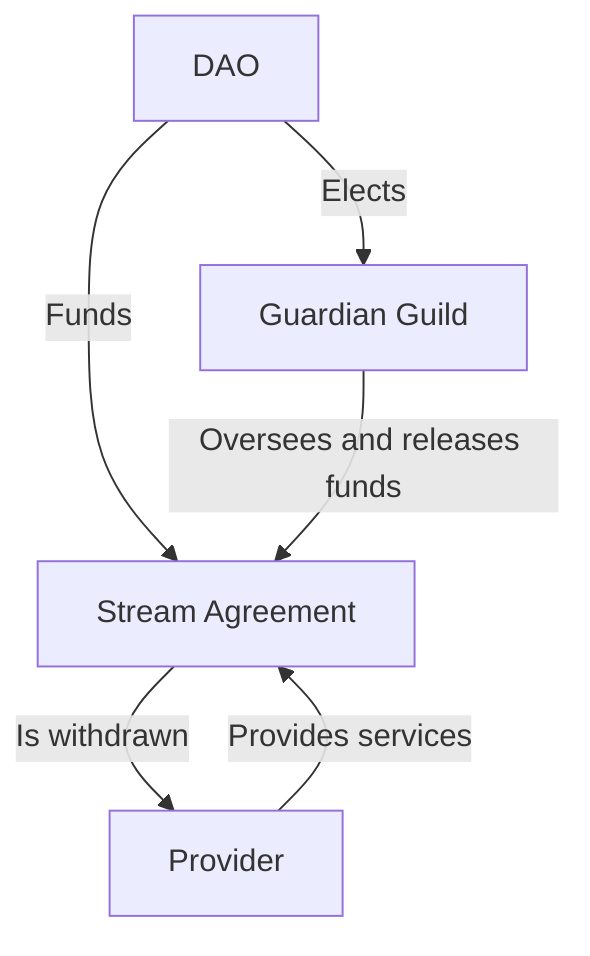

# Nation3 laws 

> :warning: This is a work-in-progress and no laws have been formally enacted by Nation3 yet.

This repository contains drafts for all law related to Nation3. It's structured as follows:
- [Constitution](https://linked.md/v?u=https://linked.md/api/github/nation3/law/main/Constitution.linked.md): Fundamental document outlining the powers of the Nation3 state, its governance and its checks and balances.
- [Laws](laws): Laws within the Nation3 jurisdiction.
- [Contracts](contracts): Contracts entered by the Nation3 DAO with relevant parties.
- [Shared](shared): Legal definitions and clauses shared across the constitution, laws and contracts.

All documents are written in [Linked Markdown](https://linked.md).

## Governance

The interactions within private contracts are regulated by laws, which are ultimately bound by the Constitution.

## Checks and balances
- Citizens are the ultimate governors of the Nation3 DAO, which shall have different voting mechanisms and thresholds for added checks and balances.
- The Nation3 DAO elects the Judges every year.
- The Supreme Court is composed by the Judges. The Nation3 DAO can open a dispute against a Judge in case of a breach of their duties, who shall be dismissed if the charges are proven.
- The Nation3 DAO shall pass laws, always in accordance with the Constitution, and the Supreme Court shall ensure their constitutionality.
- The Nation3 DAO elects the Guardian Guild every year, which has the responsibility of overseeing providers and unlock their funding.

In terms of separation of powers, it can be framed as follows:
- **Judicial**: Lies in the Supreme Court, composed of the Judges.
- **Legislative**: Lies in the DAO.
- **Executive**: Lies in the guilds and other providers, funded by the DAO and overseen by the Guardian Guild. The Supreme Court oversees the agreement between both, to ensure that the providers deliver and the Guardian Guild makes a fair assessment on their delivery.

## Funding
Nation3 DAO delegates executive functions to guilds and other providers. An agreement is entered by the DAO, the provider and the Guardian Guild. The DAO funds, the Guardian Guild oversees and releases the funding, and the provider delivers services.

