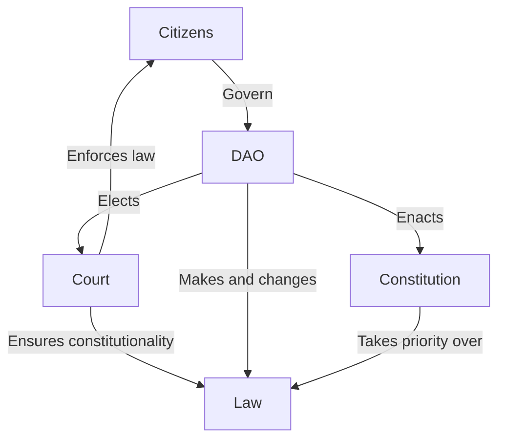
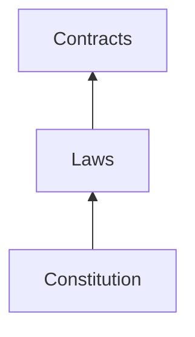

# Nation3 laws 

> :warning: This is a work-in-progress and no laws have been formally enacted by Nation3 yet.

This repository contains drafts for all law related to Nation3. It's structured as follows:
- [Constitution](https://linked.md/v?u=https://linked.md/api/github/nation3/law/main/Constitution.linked.md): Fundamental document outlining the powers of the Nation3 state, its governance and its checks and balances.
- [Laws](laws): Laws within the Nation3 jurisdiction.
- [Contracts](contracts): Contracts entered by the Nation3 DAO with relevant parties.
- [Shared](shared): Legal definitions and clauses shared across the constitution, laws and contracts.

## Governance

The interactions within private contracts are regulated by laws, which are regulated by the constitution.

## Checks and balances
- Citizens are the ultimate governors of the Nation3 DAO, which shall have different voting mechanisms and thresholds for added checks and balances.
- The Supreme Court is constituted by the Judges, which are to be elected by the Nation3 DAO every year. The Nation3 DAO can open a dispute against a Judge in case of a breach of their duties, who shall be dismissed if the charges are proven.
- The Nation3 DAO shall pass laws, always in accordance with the Constitution, and the Supreme Court shall ensure their constitutionality.

In terms of separation of powers, it can be framed as follows:
- **Judicial**: Lies in the Supreme Court, elected by the DAO.
- **Legislative**: Lies in the DAO.
- **Executive**: Lies in the Guilds and other contributors, funded by the DAO.

