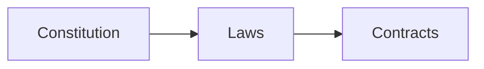
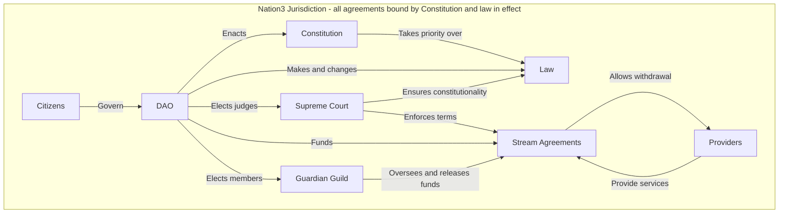
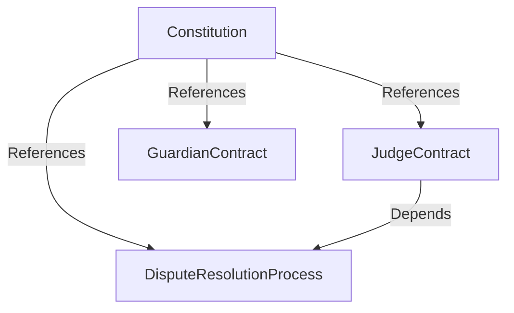

# Nation3 laws 

> :warning: This is a work-in-progress and no Constitution nor laws have been formally enacted by Nation3 yet.

This repository contains drafts for all law related to Nation3. It's structured as follows:
- [Constitution](https://linked.md/v?u=https://linked.md/api/github/nation3/law/main/Constitution.linked.md): Fundamental document outlining the powers of the Nation3 state, its governance and its checks and balances.
- [Laws](laws): Laws within the Nation3 jurisdiction.
- [Contracts](contracts): Contracts entered by the Nation3 DAO with relevant parties.
- [Shared](shared): Legal definitions and clauses shared across the constitution, laws and contracts.

All documents are written in [Linked Markdown](https://linked.md).

## Law
Contracts within the Nation3 Jurisdiction are bound by the Constitution and law in effect.

## Governance
These are the constitutional checks and balances summarized as a diagram:

- Citizens are the ultimate governors of the Nation3 DAO, which shall have different voting mechanisms and thresholds for added checks and balances.
- The Nation3 DAO elects the Judges every year.
- The Supreme Court is composed by the Judges. The Nation3 DAO can open a dispute against a Judge in case of a breach of their duties, who shall be dismissed if the charges are proven.
- The Nation3 DAO shall pass laws, always in accordance with the Constitution, and the Supreme Court shall ensure their constitutionality.
- The Nation3 DAO elects the Guardian Guild every year, which has the responsibility of overseeing providers and unlock their funding.

In terms of separation of powers, it can be framed as follows:
- **Judicial**: Lies in the Supreme Court, composed of the Judges.
- **Legislative**: Lies in the DAO.
- **Executive**: Lies in the guilds and other providers, funded by the DAO and overseen by the Guardian Guild. The Supreme Court oversees the agreement between both, to ensure that the providers deliver and the Guardian Guild makes a fair assessment on their delivery.

## Design considerations
- Citizens (through the DAO) are the ultimate governors of Nation3.
- When it comes to checks and balances, there's no denial that they can eventually be undone by the citizens themselves, with enough time and support. But the system encodes tons of friction to slow down their erosion.
- The Guardian Guild needs to exist because depending on the whole DAO to keep an informed eye on all deliverables and funding proposals is impractical and lacks ownership.
- The DAO can be trusted to elect Judges once a year, and to dismiss Judges in breach from time to time.
- If a Judge is in breach of their duties, the rest of the Judges can be trusted to rule against that Judge in breach. If they collude, they know they will be all replaced by the DAO, so it's in their incentive not to collude.
- The Court and the Guardian Guild are completely separate entities, and thus providers can rely on the Court in case that the Guardian Guild is providing a wrong judgement on a provider's deliverables. 

## Dependency chart
Non-exhaustive dependency chart detailing the different files in this repo.

- [Constitution](https://linked.md/v?u=https://linked.md/api/github/nation3/law/main/Constitution.linked.md): Highest standing agreement among Citizens, Judges and Guardians.
- [Judge Agreement](https://linked.md/v?u=https://linked.md/api/github/nation3/law/main/contracts/JudgeContract.linked.md): Agreement between Supreme Court Judges and Nation3 DAO.
- [Guardian Agreement](https://linked.md/v?u=https://linked.md/api/github/nation3/law/main/contracts/GuardianContract.linked.md): Agreement between Guardian Guild members and Nation3 DAO.
- [Dispute Resolution Process](https://linked.md/v?u=https://linked.md/api/github/nation3/law/main/contracts/DisputeResolutionProcess.linked.md): Process that Judges and Nation3 DAO follow for disputes within the Nation3 Jurisdiction, including evidence submission.

